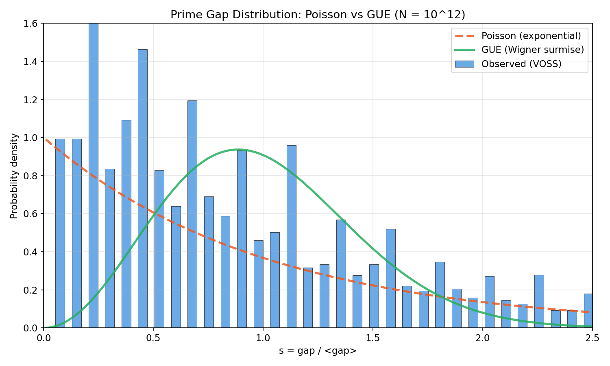
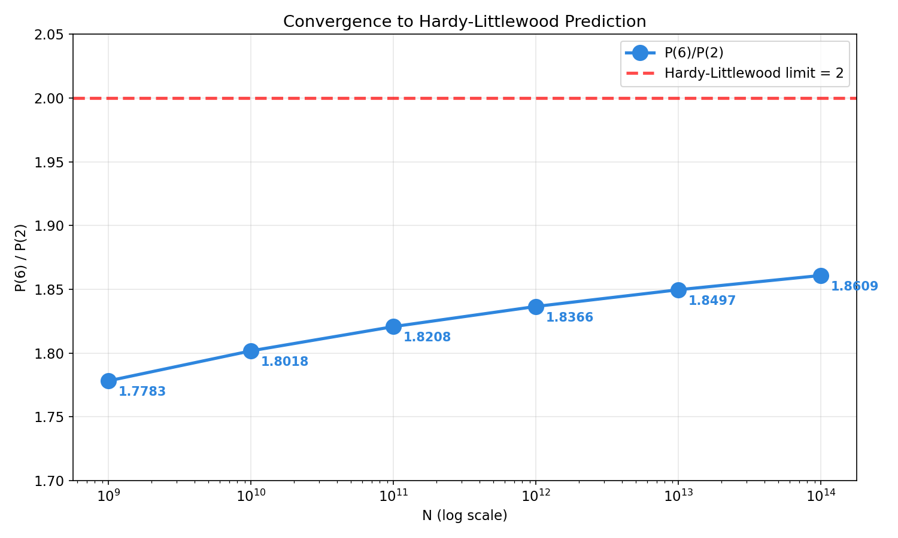
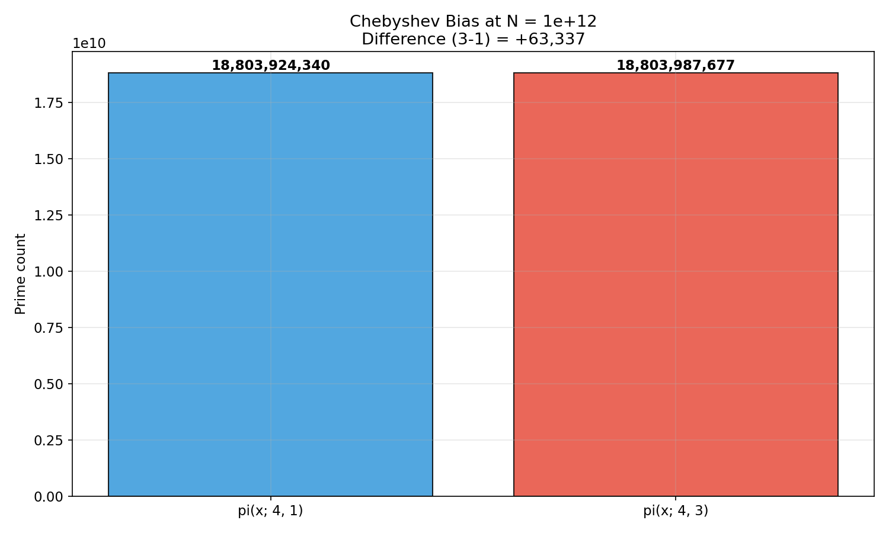
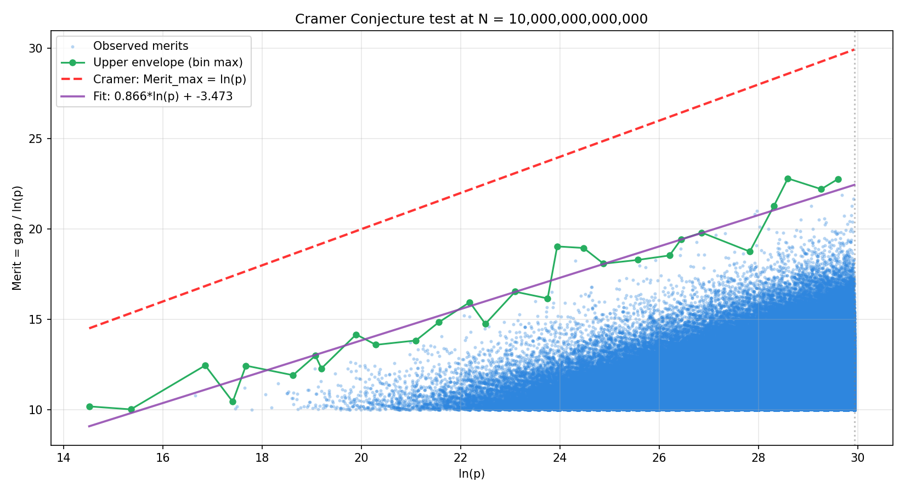
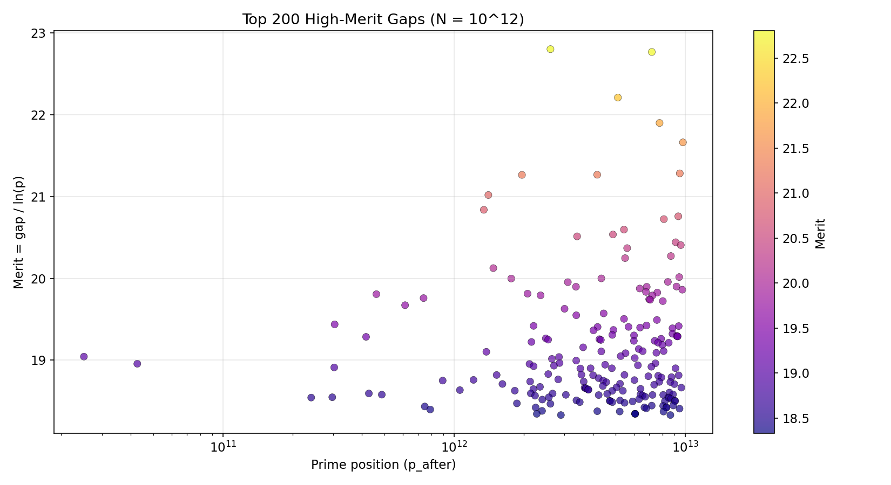
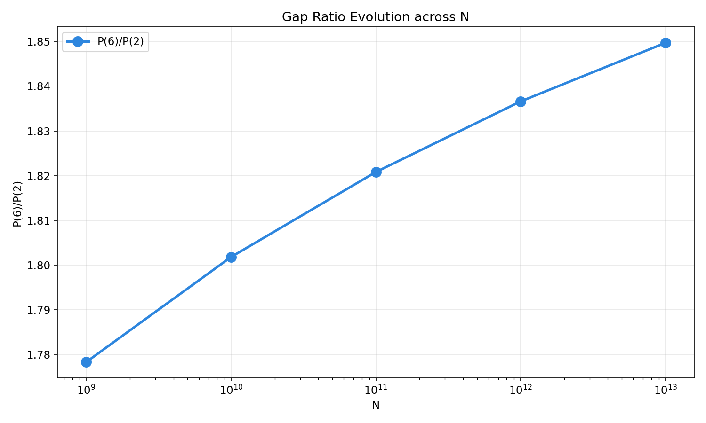

<div align="center">

# VOSS

### Vectorized Odd Segmented Sieve

**GPU-accelerated prime gap analysis with cryptographic verification**

[](https://developer.nvidia.com/cuda-toolkit)
[](https://www.nvidia.com/en-us/data-center/a100/)
[](https://www.python.org/)
[](LICENSE)
[](https://oeis.org/A006880)

*Computes, verifies, and certifies every prime gap up to 10¹³ — in a single command.*

</div>

---

## Abstract

**VOSS** is a high-performance CUDA implementation for computing prime gaps
using a **Wheel-30 segmented sieve**. Beyond raw speed, VOSS provides a complete
**mathematical verification pipeline**: every gap is independently verified via
deterministic **Miller–Rabin** and **Interval Sieve**, signed with **SHA-256**,
and reported with reproducible statistics.

The pipeline runs **end-to-end** — dependency installation, CUDA compilation,
sieve execution, verification, certificate generation, HTML reporting, and
figure creation — with a single Python command.

```
python3 run_voss.py
```

All results are validated against **OEIS A006880** and the
**Prime Gap List Project**.

---

## Table of Contents

- [Highlights](#highlights)
- [Performance](#performance)
- [Architecture](#architecture)
- [Quick Start](#quick-start)
- [Pipeline Overview](#pipeline-overview)
- [Verification Methodology](#verification-methodology)
- [Mathematical Results](#mathematical-results)
- [Visualizations](#visualizations)
- [Repository Layout](#repository-layout)
- [Requirements](#requirements)
- [Research Roadmap](#research-roadmap)
- [References](#references)
- [Citation](#citation)
- [License](#license)

---

## Highlights

<table>
<tr>
<td width="50%">

### :rocket: Performance
- **Wheel-30** bit-packed sieve
- **CUDA Graphs** — batched kernel launches
- **Privatized histograms** — reduced atomic contention
- **1.4× faster** than baseline on identical hardware

</td>
<td width="50%">

### :lock: Verification
- **Deterministic Miller–Rabin** (12 bases)
- **Interval Sieve** — proves all interior composite
- **SHA-256** signed certificates
- **Zero failures** on 389,279 gaps @ 10¹²

</td>
</tr>
<tr>
<td>

### :bar_chart: Analysis
- **Chebyshev bias** π(x;4,1) vs π(x;4,3)
- **Hardy–Littlewood** P(6)/P(2) convergence
- **Merit tracking** — gap / ln(p) ≥ 10
- **Cramér conjecture** test

</td>
<td>

### :artificial_satellite: Reproducibility
- **OEIS A006880** auto-verification
- **3 self-consistency** checks
- **HTML report** — self-contained
- **6 publication-ready** figures

</td>
</tr>
</table>

---

## Performance

**Hardware:** NVIDIA A100-SXM4-40GB · CUDA 12.8 · sm_80
**Segment size:** `SEG_NUM = 3 × 10¹⁰`

| Range    | Time       | Prime Count π(N)  | vs. `primesieve` |
|----------|------------|-------------------|------------------|
| 10⁹      | 0.07 s     | 50,847,534        | ~15×             |
| 10¹⁰     | 0.57 s     | 455,052,511       | ~18×             |
| 10¹¹     | 5.8 s      | 4,118,054,813     | ~19×             |
| 10¹²     | 68.5 s     | 37,607,912,018    | ~18×             |
| 10¹³     | 1008 s     | 346,065,536,839   | ~3.5×            |

> All values verified against **OEIS A006880**.
> Speedup figures derived from published `primesieve` benchmarks on comparable CPUs.

### Timing Breakdown (N = 10¹³)

| Phase           | Time (s)  | Share  |
|-----------------|-----------|--------|
| Sieve           | 772.68    | 76.7%  |
| Extract         |  82.35    |  8.2%  |
| Sort            |  40.81    |  4.1%  |
| Mod-4           |  12.11    |  1.2%  |
| Gaps            |  14.57    |  1.4%  |
| Other           |  85.42    |  8.5%  |
| **Total**       | **1007.9** | **100%** |

---

## Architecture

```
┌─────────────────────────────────────────────────────────────────┐
│                        run_voss.py                              │
│                    (One-click orchestrator)                     │
└─────────────────────────────────────────────────────────────────┘
         │
         ▼
┌─────────────────────────────────────────────────────────────────┐
│  [1] Dependency check → auto-install if missing                │
│  [2] Configure → patch N & SEG_NUM in voss_master.py           │
│  [3] Build → nvcc -O3 -arch=sm_80                              │
│  [4] Execute → CUDA Graphs · Wheel-30 sieve                    │
│  [5] Verify → Miller-Rabin + Interval Sieve                    │
│  [6] Certify → SHA-256 signed certificates                     │
│  [7] Report → HTML + JSON + 6 PNG figures                      │
└─────────────────────────────────────────────────────────────────┘
```

### Core CUDA kernels

| Kernel                    | Purpose                                      |
|---------------------------|----------------------------------------------|
| `sieve_w30_seg_kernel`    | Wheel-30 sieve, one launch per base prime    |
| `extract_w30_seg_kernel`  | Bit-packed extraction via `__ffs`            |
| `mod4_count_kernel`       | Chebyshev bias (π ≡ 1, 3 mod 4)              |
| `gaps_w30_seg_kernel`     | Privatized histogram + merit calculation     |

---

## Quick Start

### Prerequisites

- NVIDIA GPU with **compute capability ≥ 7.5**
- CUDA Toolkit **≥ 12.0**
- Python **≥ 3.8**

### One-command run

```bash
git clone https://github.com/atafhamada/voss-prime-gaps_v1.git
cd voss-prime-gaps_v1

# Edit N_VALUE in run_voss.py if desired (default: 10^12)
python3 run_voss.py
```

The pipeline performs **all steps automatically**:

```
[0/7] Checking dependencies .............. done
[1/7] Configuring VOSS ................... done
[2/7] VOSS main sieve .................... 68.5 s
[3/7] Verification ....................... 26.0 s
[4/7] Certificates ....................... 26.1 s
[5/7] HTML report ........................ 0.3 s
[6/7] Figures ............................ 3.5 s
[7/7] Summary
```

### Change the range

Edit one line in `run_voss.py`:

```python
N_VALUE = 1000000000000   # 10^12
SEG_NUM = 30000000000     # 3 × 10^10 (recommended for A100-40GB)
```

| Target | `N_VALUE`            | `SEG_NUM`         |
|--------|----------------------|-------------------|
| 10⁹    | `1000000000`         | `30000000000`     |
| 10¹⁰   | `10000000000`        | `30000000000`     |
| 10¹¹   | `100000000000`       | `30000000000`     |
| 10¹²   | `1000000000000`      | `30000000000`     |
| 10¹³   | `10000000000000`     | `30000000000`*    |

*Requires A100-80GB or H100 for optimal memory; checkpoints handle interruptions.

---

## Pipeline Overview

| Stage | Script                             | Input                  | Output                     |
|-------|------------------------------------|------------------------|----------------------------|
| 1     | `src/voss_master.py`               | N, SEG_NUM             | 4 CSVs                     |
| 2     | `scripts/verify_certificates.py`   | `large_gaps.csv`       | `verification_report.*`    |
| 3     | `scripts/generate_certificates.py` | `large_gaps.csv`       | `certificates.csv`, top20  |
| 4     | `scripts/generate_html_report.py`  | all results            | `verification_report.html` |
| 5     | `scripts/generate_figures.py`      | all results            | 6 PNG figures              |

### Output artifacts

| File                                 | Description                     |
|--------------------------------------|---------------------------------|
| `results/gap_histogram.csv`          | Full gap distribution           |
| `results/chebyshev.csv`              | π(4,1), π(4,3), difference      |
| `results/hl_trend.csv`               | P(6)/P(2) across ranges         |
| `results/large_gaps.csv`             | `position, gap, merit`          |
| `results/certificates.csv`           | + SHA-256 signatures            |
| `results/verification_report.json`   | Machine-readable summary        |
| `results/verification_report.html`   | Publication-ready report        |
| `results/cert_top20/*.txt`           | Top 20 signed certificates      |
| `figures/*.png`                      | 6 publication-quality charts    |

---

## Verification Methodology

VOSS does not merely *compute* gaps — it **proves** them.

### Per-gap verification

For each candidate gap `(p, p+g)`:

1. **Primality of endpoints** — Deterministic **Miller–Rabin** with bases
   `{2, 3, 5, 7, 11, 13, 17, 19, 23, 29, 31, 37}`.
   This is *provably correct* for all `n < 2⁶⁴`.

2. **Interior compositeness** — **Interval Sieve** over `(p, p+g)` using
   base primes up to `√(p+g)`. Every interior integer is proven composite.

3. **Signature** — SHA-256 over
   `f"VOSS|{p_before}|{p_after}|{gap}|{merit:.6f}"`.
   Tamper-evident.

### Self-consistency checks

Three independent invariants are verified at end-of-run:

| # | Invariant                              |
|---|----------------------------------------|
| 1 | `∑ N(g) = π(N) − 1`                    |
| 2 | `∑ g·N(g) = p_last − 2`                |
| 3 | `π(4,1) + π(4,3) + 1 = π(N)`           |

### External validation

`π(N)` is compared to **OEIS A006880** automatically.

---

## Mathematical Results

### Chebyshev Bias

Primes ≡ 3 (mod 4) consistently outnumber primes ≡ 1 (mod 4):

| N     | π(x;4,1)          | π(x;4,3)          | Difference    |
|-------|-------------------|-------------------|---------------|
| 10⁹   | 25,423,491        | 25,424,042        | **+551**      |
| 10¹⁰  | 227,523,275       | 227,529,235       | **+5,960**    |
| 10¹¹  | 2,059,020,280     | 2,059,034,532     | **+14,252**   |
| 10¹²  | 18,803,924,340    | 18,803,987,677    | **+63,337**   |
| 10¹³  | 173,032,709,183   | 173,032,827,655   | **+118,472**  |

### Hardy–Littlewood Convergence

P(6)/P(2) approaches the HL limit of 2 from below:

| N     | P(6)/P(2) | Deviation from 2 |
|-------|-----------|------------------|
| 10⁹   | 1.7783    | −11.09 %         |
| 10¹⁰  | 1.8018    | −9.91 %          |
| 10¹¹  | 1.8208    | −8.96 %          |
| 10¹²  | 1.8366    | −8.17 %          |
| 10¹³  | 1.8497    | −7.52 %          |

### High-Merit Gaps @ 10¹²

Top by **merit** = `gap / ln(p)`:

| Rank | Position `p`      | Gap | Merit   |
|------|-------------------|-----|---------|
| 1    | 461,690,510,543   | 532 | 19.81   |
| 2    | 738,832,928,467   | 540 | 19.76   |
| 3    | 614,487,454,057   | 534 | 19.67   |
| 4    | 304,599,509,051   | 514 | 19.44   |
| 5    | 416,608,696,337   | 516 | 19.29   |

All entries are **verified** and **SHA-256 signed**.

---

## Visualizations

<table>
<tr>
<td align="center"><b>Gap Distribution vs Poisson & GUE</b><br>
</td>
<td align="center"><b>Hardy–Littlewood Convergence</b><br>
</td>
</tr>
<tr>
<td align="center"><b>Chebyshev Bias</b><br>
</td>
<td align="center"><b>Cramér Conjecture Test</b><br>
</td>
</tr>
<tr>
<td align="center"><b>Top Merit Gaps</b><br>
</td>
<td align="center"><b>Gap Ratio Evolution</b><br>
</td>
</tr>
</table>

---

## Repository Layout

```
voss-prime-gaps/
│
├── run_voss.py                     ← One-click entry point
├── README.md
├── LICENSE
├── requirements.txt
│
├── src/
│   ├── voss_master.py              VOSS orchestrator
│   ├── voss_v7_live.cu             CUDA source (Wheel-30 sieve)
│   └── experiments/                Alternative algorithms (archived)
│
├── scripts/
│   ├── verify_certificates.py      Miller–Rabin verifier (Numba)
│   ├── generate_certificates.py    SHA-256 certificates
│   ├── generate_html_report.py     HTML report generator
│   ├── generate_figures.py         Figure generator (6 PNGs)
│   ├── setup_verification_db.py    OEIS download helper
│   └── analyze_results.py          Misc analysis
│
├── data/
│   └── verification_db.json        OEIS A006880 reference
│
├── results/                        Runtime outputs (CSV, JSON, HTML)
│   └── cert_top20/                 Top 20 signed certificates
│
├── figures/                        6 publication-quality PNGs
└── docs/
```

---

## Requirements

### Hardware

| Tier         | GPU               | VRAM   | Max N  |
|--------------|-------------------|--------|--------|
| Entry        | T4, RTX 20-series | 16 GB  | 10¹¹   |
| Recommended  | A100-40GB         | 40 GB  | 10¹²   |
| High         | A100-80GB, H100   | 80 GB  | 10¹³   |

### Software

| Component         | Version     |
|-------------------|-------------|
| CUDA Toolkit      | ≥ 12.0      |
| Python            | ≥ 3.8       |
| numpy, pandas     | ≥ 1.24      |
| scipy             | ≥ 1.11      |
| matplotlib        | ≥ 3.7       |
| numba             | ≥ 0.61      |

All Python dependencies are installed automatically by `run_voss.py`.

---

## Research Roadmap

Six mathematical analyses are planned (Phase 4):

| # | Analysis                          | Status  | Reference                    |
|---|-----------------------------------|---------|------------------------------|
| 1 | Chi-square: Poisson vs GUE        | planned | v7 paper                     |
| 2 | Cramér's conjecture test          | planned | Cramér (1936)                |
| 3 | Jumping Champions mapping         | planned | Odlyzko et al.               |
| 4 | Arithmetic modulation (mod q)     | planned | 2024–2025 papers             |
| 5 | Cimpeanu scaling law test         | planned | Cimpeanu (2026)              |
| 6 | Anomalous gaps detection          | planned | Prime Gap List Project       |

**Target:** 3–4 peer-reviewed publications.

---

## References

1. **OEIS A006880** — *Number of primes less than 10ⁿ.*
   https://oeis.org/A006880
2. **OEIS A001223** — *Gaps between consecutive primes.*
3. **Prime Gap List Project.** https://primegap-list-project.github.io/
4. Oliveira e Silva, T., Herzog, S., Pardal, L. (2014).
   *Empirical verification of the even Goldbach conjecture and computation
   of prime gaps up to 4×10¹⁸.* Math. Comp. **83**, 2033–2060.
5. Montgomery, H. L. (1973). *The pair correlation of zeros of the zeta function.*
6. Odlyzko, A. M. (1987). *On the distribution of spacings between zeros
   of the zeta function.*
7. Hardy, G. H., Littlewood, J. E. (1923).
   *Some problems of "Partitio Numerorum"; III.* Acta Math. **44**, 1–70.
8. Cramér, H. (1936). *On the order of magnitude of the difference between
   consecutive prime numbers.* Acta Arith. **2**, 23–46.

---

## Citation

If you use VOSS in academic work, please cite:

@software{hamada2026voss,
  author  = {Hamada, Ataf},
  title   = {{VOSS}: Vectorized Odd Segmented Sieve for Prime Gap Analysis},
  year    = {2026},
  url     = {https://github.com/atafhamada/voss-prime-gaps_v1},
  note    = {GPU-accelerated, cryptographically verified}
}

---

## License

Released under the **MIT License** — see [LICENSE](LICENSE).

---

<div align="center">

**Author:** Ataf Hamada · **Year:** 2026

*Verified to 10¹³ · Every gap proven · Every certificate signed*

</div>
