<div align="center">

# VOSS

### Vectorized Odd Segmented Sieve

**GPU-accelerated prime gap analysis with cryptographic verification**

[](https://developer.nvidia.com/cuda-toolkit)
[](https://www.nvidia.com/en-us/data-center/a100/)
[](https://www.python.org/)
[](LICENSE)
[](https://oeis.org/A006880)
[](https://github.com/atafhamada/voss-prime-gaps_v1)
[](https://github.com/atafhamada/voss-prime-gaps_v1/blob/main/results/confidence_scores.json)

*Computes, verifies, and certifies every prime gap up to 10¹⁴ — in a single command.*

</div>

---

## Abstract

**VOSS** is a high-performance CUDA implementation for computing prime gaps
using a **Wheel-30 segmented sieve**. Beyond raw speed, VOSS provides a complete
**mathematical verification pipeline**: every gap is independently verified via
deterministic **Miller–Rabin** and **Interval Sieve**, signed with **SHA-256**,
and reported with reproducible statistics.

VOSS also includes **12 mathematical analyses** with documented confidence levels
(project-wide: **98.7%**). The pipeline runs **end-to-end** — dependency
installation, CUDA compilation, sieve execution, verification, certificate
generation, statistical analysis, HTML reporting, and figure creation — with a
single Python command.

```
python3 run_voss.py
```

All results are validated against **OEIS A006880** and the
**Prime Gap List Project**.

---

## Table of Contents

- [Highlights](#highlights)
- [Performance](#performance)
- [Architecture](#architecture)
- [Quick Start](#quick-start)
- [Pipeline Overview](#pipeline-overview)
- [Verification Methodology](#verification-methodology)
- [Mathematical Results](#mathematical-results)
- [Confidence & Novelty](#confidence--novelty)
- [Limitations & Caveats](#limitations--caveats)
- [Visualizations](#visualizations)
- [Repository Layout](#repository-layout)
- [Requirements](#requirements)
- [Research Roadmap](#research-roadmap)
- [References](#references)
- [Citation](#citation)
- [License](#license)

---

## Highlights

<table>
<tr>
<td width="50%">

### :rocket: Performance
- **Wheel-30** bit-packed sieve
- **CUDA Graphs** — batched kernel launches
- **Privatized histograms** — reduced atomic contention
- **1.4× faster** than baseline on identical hardware

</td>
<td width="50%">

### :lock: Verification
- **Deterministic Miller–Rabin** (12 bases)
- **Interval Sieve** — proves all interior composite
- **SHA-256** signed certificates
- **Zero failures** on 389,279 gaps @ 10¹²

</td>
</tr>
<tr>
<td>

### :bar_chart: Analysis
- **12 mathematical analyses** with confidence scores
- **Chebyshev bias** π(x;4,1) vs π(x;4,3)
- **Hardy–Littlewood** P(6)/P(2) convergence
- **k-tuples, autocorrelation, Legendre, Brun**
- **Confidence: 98.7%** project-wide

</td>
<td>

### :artificial_satellite: Reproducibility
- **OEIS A006880** auto-verification
- **3 self-consistency** checks
- **HTML report** — self-contained
- **17 publication-ready** figures

</td>
</tr>
</table>

---

## Performance

**Hardware:** NVIDIA A100-SXM4-40GB · CUDA 12.8 · sm_80
**Segment size:** `SEG_NUM = 3 × 10¹⁰`

| Range    | Time       | Prime Count π(N)  | vs. `primesieve` |
|----------|------------|-------------------|------------------|
| 10⁹      | 0.07 s     | 50,847,534        | ~15×             |
| 10¹⁰     | 0.57 s     | 455,052,511       | ~18×             |
| 10¹¹     | 5.8 s      | 4,118,054,813     | ~19×             |
| 10¹²     | 68.5 s     | 37,607,912,018    | ~18×             |
| 10¹³     | 954 s      | 346,065,536,839   | ~3.8×            |
| 10¹⁴     | 21,671 s   | 3,204,941,750,802 | ~2.9×            |

> All values verified against **OEIS A006880**.
> Speedup figures derived from published `primesieve` benchmarks on comparable CPUs.
> 10¹⁴ computed on A100-80GB (single GPU) in 6.39 hours.

### Timing Breakdown (N = 10¹⁴)

| Phase           | Time (s)    | Share  |
|-----------------|-------------|--------|
| Sieve           | 16,959.18   | 78.26% |
| Extract         |    838.99   |  3.87% |
| Sort            |    354.99   |  1.64% |
| Mod-4 + modq    |    203.85   |  0.94% |
| Gaps            |    279.75   |  1.29% |
| Other           |  3,033.80   | 14.00% |
| **Total**       | **21,670.57** | **100%** |

---

## Architecture

```
┌─────────────────────────────────────────────────────────────────┐
│                        run_voss.py                              │
│                    (One-click orchestrator)                     │
└─────────────────────────────────────────────────────────────────┘
         │
         ▼
┌─────────────────────────────────────────────────────────────────┐
│  [1] Dependency check → auto-install if missing                │
│  [2] Configure → patch N & SEG_NUM in voss_master.py           │
│  [3] Build → nvcc -O3 -arch=sm_80                              │
│  [4] Execute → CUDA Graphs · Wheel-30 sieve                    │
│  [5] Verify → Miller-Rabin + Interval Sieve                    │
│  [6] Certify → SHA-256 signed certificates                     │
│  [7] Report → HTML + JSON + 6 PNG figures                      │
└─────────────────────────────────────────────────────────────────┘
```

### Core CUDA kernels

| Kernel                    | Purpose                                      |
|---------------------------|----------------------------------------------|
| `sieve_w30_seg_kernel`    | Wheel-30 sieve, one launch per base prime    |
| `extract_w30_seg_kernel`  | Bit-packed extraction via `__ffs`            |
| `mod4_count_kernel`       | Chebyshev bias (π ≡ 1, 3 mod 4)              |
| `gaps_w30_seg_kernel`     | Privatized histogram + merit + per-residue   |
| `modq_count_kernel`       | Prime count per residue (mod 6, 30)          |

---

## Quick Start

### Prerequisites

- NVIDIA GPU with **compute capability ≥ 7.5**
- CUDA Toolkit **≥ 12.0**
- Python **≥ 3.8**

### One-command run

```bash
git clone https://github.com/atafhamada/voss-prime-gaps_v1.git
cd voss-prime-gaps_v1

# Edit N_VALUE in run_voss.py if desired (default: 10^12)
python3 run_voss.py
```

The pipeline performs **all steps automatically**:

```
[0/8] Checking dependencies .............. done
[1/8] Configuring VOSS ................... done
[2/8] VOSS main sieve .................... 69.2 s
[3/8] Verification (C++, cached) ......... 0.8 s
[4/8] Certificates ....................... 6.7 s
[5/8] HTML report ........................ 2.5 s
[6/8] Figures ............................ 8.0 s
[7/8] Mathematical analyses .............. 6.0 s
[8/8] Summary
```

### Change the range

Edit one line in `run_voss.py`:

```python
N_VALUE = 1000000000000   # 10^12
SEG_NUM = 30000000000     # 3 × 10^10 (recommended for A100-40GB)
```

| Target | `N_VALUE`            | `SEG_NUM`         |
|--------|----------------------|-------------------|
| 10⁹    | `1000000000`         | `30000000000`     |
| 10¹⁰   | `10000000000`        | `30000000000`     |
| 10¹¹   | `100000000000`       | `30000000000`     |
| 10¹²   | `1000000000000`      | `30000000000`     |
| 10¹³   | `10000000000000`     | `30000000000`*    |

*Requires A100-80GB or H100 for optimal memory; checkpoints handle interruptions.

---

## Pipeline Overview

| Stage | Script                             | Input                  | Output                     |
|-------|------------------------------------|------------------------|----------------------------|
| 1     | `src/voss_master.py`               | N, SEG_NUM             | 5 CSVs                     |
| 2     | `bin/verify_cpp` (C++)             | `large_gaps.csv`       | `verification_details.csv` |
| 3     | `scripts/generate_certificates.py` | `large_gaps.csv`       | `certificates.csv`, top20  |
| 4     | `scripts/generate_html_report.py`  | all results            | `verification_report.html` |
| 5     | `scripts/generate_figures.py`      | all results            | 6 PNG figures              |
| 6     | `scripts/{chi_square,cramer,...}.py` | all results          | 6 JSON + 5 PNG             |

### Output artifacts

| File                                 | Description                     |
|--------------------------------------|---------------------------------|
| `results/gap_histogram.csv`          | Full gap distribution           |
| `results/chebyshev.csv`              | π(4,1), π(4,3), difference      |
| `results/modq_counts.csv`            | Prime count per residue (mod 6, 30) |
| `results/modq_gap_hist.csv`          | Gap histogram per residue (mod 6, 30) |
| `results/verification_cache.csv`     | Cached verifications (persistent) |
| `results/hl_trend.csv`               | P(6)/P(2) across ranges         |
| `results/large_gaps.csv`             | `position, gap, merit`          |
| `results/certificates.csv`           | + SHA-256 signatures            |
| `results/verification_report.json`   | Machine-readable summary        |
| `results/verification_report.html`   | Publication-ready report        |
| `results/cert_top20/*.txt`           | Top 20 signed certificates      |
| `figures/*.png`                      | 6 publication-quality charts    |

---

## Verification Methodology

VOSS does not merely *compute* gaps — it **proves** them.

### Per-gap verification

For each candidate gap `(p, p+g)`:

1. **Primality of endpoints** — Deterministic **Miller–Rabin** with bases
   `{2, 3, 5, 7, 11, 13, 17, 19, 23, 29, 31, 37}`.
   This is *provably correct* for all `n < 2⁶⁴`.

2. **Interior compositeness** — **Interval Sieve** over `(p, p+g)` using
   base primes up to `√(p+g)`. Every interior integer is proven composite.

3. **Signature** — SHA-256 over
   `f"VOSS|{p_before}|{p_after}|{gap}|{merit:.6f}"`.
   Tamper-evident.

### Self-consistency checks

Three independent invariants are verified at end-of-run:

| # | Invariant                              |
|---|----------------------------------------|
| 1 | `∑ N(g) = π(N) − 1`                    |
| 2 | `∑ g·N(g) = p_last − 2`                |
| 3 | `π(4,1) + π(4,3) + 1 = π(N)`           |

### External validation

`π(N)` is compared to **OEIS A006880** automatically.

---

## Mathematical Results

### Chebyshev Bias

Primes ≡ 3 (mod 4) consistently outnumber primes ≡ 1 (mod 4):

| N     | π(x;4,1)          | π(x;4,3)          | Difference    |
|-------|-------------------|-------------------|---------------|
| 10⁹   | 25,423,491        | 25,424,042        | **+551**      |
| 10¹⁰  | 227,523,275       | 227,529,235       | **+5,960**    |
| 10¹¹  | 2,059,020,280     | 2,059,034,532     | **+14,252**   |
| 10¹²  | 18,803,924,340    | 18,803,987,677    | **+63,337**   |
| 10¹³  | 173,032,709,183   | 173,032,827,655   | **+118,472**  |
| 10¹⁴  | 1,602,470,783,672 | 1,602,470,967,129 | **+183,457**  |

### Hardy–Littlewood Convergence

P(6)/P(2) approaches the HL limit of 2 from below:

| N     | P(6)/P(2) | Deviation from 2 |
|-------|-----------|------------------|
| 10⁹   | 1.7783    | −11.09 %         |
| 10¹⁰  | 1.8018    | −9.91 %          |
| 10¹¹  | 1.8208    | −8.96 %          |
| 10¹²  | 1.8366    | −8.17 %          |
| 10¹³  | 1.8497    | −7.52 %          |
| 10¹⁴  | 1.8609    | −6.96 %          |

### High-Merit Gaps @ 10¹⁴

Top by **merit** = `gap / ln(p)`:

| Rank | Position `p`           | Gap | Merit   |
|------|------------------------|-----|---------|
| 1    | 2,614,941,711,251      | 652 | 22.80   |
| 2    | 7,177,162,612,387      | 674 | 22.77   |
| 3    | 5,120,731,250,857      | 650 | 22.21   |
| 4    | 11,082,394,066,759     | 662 | 22.04   |
| 5    | 10,653,514,292,503     | 660 | 22.00   |

All entries are **verified** and **SHA-256 signed**.

---

### Arithmetic Modulation (mod q)

The distribution of prime **gaps** differs across residue classes mod q.
We measure:
β(q) = mean_{a coprime to q} ‖ P(gap | a, q) − P(gap | q) ‖₁

text

| q  | residues | β(q)   | max deviation |
|----|----------|--------|---------------|
| 6  | 2        | 0.5467 | 0.5467        |
| 30 | 8        | 0.8473 | 0.9128        |

The observed growth is consistent with the empirical scaling law
`β(q) ≈ 0.577·log₁₀(q) − 0.601` (slope ratio 0.745).

---

### k-tuples & Related Counts @ 10¹¹

Hardy–Littlewood predictions vs observed (twins/cousins/sexy: full N; triplets/quadruplets: sample):

| Type | Observed | HL Prediction | Ratio |
|------|----------|---------------|-------|
| Twins (p, p+2) | 224,376,048 | 205,808,661 | 1.090 |
| Cousins (p, p+4) | 224,373,160 | — | — |
| Sexy (p, p+6) | 408,550,278 | 411,617,323 | 0.993 |
| Octuplets (p, p+8) | 185,402,143 | — | — |
| Triplets (2-4) | 23,581 | 23,374 | **1.009** |
| Quadruplets (2-4-2) | 1,379 | 1,372 | **1.004** |

Triplets/quadruplets measured from a **distributed sample of 5M real gaps** spanning 10¹⁰ → 9.5×10¹⁰.

### Autocorrelation (real sequence)

From 5M consecutive prime gaps (normalized by ln p):

| Lag | Autocorrelation |
|-----|-----------------|
| 1 | **−0.0379** |
| 2 | −0.0186 |
| 5 | −0.0073 |
| 10 | −0.0037 |

44 of 50 lags outside 95% CI → **structure detected**.

Consistent with **Ares & Castro (2006)**: negative lag-1 autocorrelation of consecutive prime gaps.

### Legendre's Conjecture (n ≤ 10,000)

| Metric | Value |
|--------|-------|
| Intervals tested | 10,000 |
| Intervals with ≥ 1 prime | **10,000** (100%) |
| Min primes per interval | 2 |
| Max primes per interval | 1,168 |
| Max gap to first prime after n² | 147 |

**Result: 100% pass for n ≤ 10⁴** — empirical support (not a proof).

### Brun's Constant (improved estimate)

Using Nicely's partial sums + theoretical remainder:

| Metric | Value |
|--------|-------|
| Known B₂ limit | 1.902160583104 |
| Our estimate | 1.8599263449 |
| Error | −2.22% |
| Status | Verification (not discovery) |

### Hardy–Littlewood Singular Series (small-gap regime)

Ratios of observed / HL prediction:

| Gap | S(k) | Ratio |
|-----|------|-------|
| 2 | 1.320 | 1.090 |
| 4 | 1.320 | 1.090 |
| 6 | 2.641 | **0.993** |
| 8 | 1.320 | 0.901 |
| 10 | 1.760 | 0.879 |

**Small-gap mean ratio: 0.99** (excellent agreement). Large gaps require finite-size corrections.

### Kolmogorov–Smirnov Test

| Model | KS Statistic | Bootstrap Stable? |
|-------|--------------|-------------------|
| Poisson | 0.043 | ✅ |
| GUE | 0.281 | ✅ |

Poisson is closer by **6.5×**; consistent across bootstrap resamples.

### Dirichlet Residue Distribution

Primes are uniformly distributed across residues mod q (Dirichlet, 1837):

| q | Residues Tested | β(q) |
|---|-----------------|------|
| 6 | 2 | 0.541 |
| 30 | 8 | 0.839 |

β(q) grows with q, consistent with theoretical predictions.

---

## Confidence & Novelty

Each analysis carries **two independent scores**:

| Metric | Meaning | Project Average |
|--------|---------|-----------------|
| **Confidence** | Probability that results are correct | **98.7%** |
| **Novelty** | How new are the findings | 45.4% |

**Confidence** = 0.5·computation + 0.5·interpretation
- All computations are exact (100%)
- Interpretation varies by theory strength (92–100%)

**Novelty** is a separate axis:
- 100% = brand new discovery
- 0% = verification of known result
- 45% avg = mix of verification and new measurements

A result can be **100% correct but 20% novel** (e.g., Legendre: verified for n ≤ 10⁴).
A result can be **80% correct but 100% novel** (e.g., a recently proposed law).

Full per-analysis scores: `results/confidence_scores.json`

---

## Limitations & Caveats

VOSS reports *all* limitations transparently. Key caveats:

### Statistical analyses (Chi-square, KS)
- **p-values are uninformative at N > 10⁹** — any small deviation yields p = 0.
- We use **effect sizes** (Cohen's w, Cramér's V) instead.
- Bin-dependent results → we test **multiple bin configurations**.

### Theoretical comparisons (Cramér, Cimpeanu, HL)
- Cramér predicts a **limsup**; finite-N comparison is approximate.
- The Cimpeanu (2026) law is **recent** and **not independently verified**.
- HL singular series is **asymptotic**; finite-size corrections (~4% at N=10¹¹) apply.

### Verification of known results (Autocorrelation, Brun, Legendre)
- **Autocorrelation**: negative correlation is known since Ares-Castro (2006). We confirm it at 10¹¹.
- **Brun's constant**: uses external partial sums from Nicely; this is **verification**, not discovery.
- **Legendre**: tested for n ≤ 10⁴ only; **not a proof**.

### Open problems
No data can prove Riemann Hypothesis, Legendre's Conjecture, or Cramér's Conjecture.
VOSS provides **empirical evidence** but claims **no mathematical proofs**.

---

## Visualizations

<table>
<tr>
<td align="center"><b>Gap Distribution vs Poisson & GUE</b><br>
</td>
<td align="center"><b>Hardy–Littlewood Convergence</b><br>
</td>
</tr>
<tr>
<td align="center"><b>Chebyshev Bias</b><br>
</td>
<td align="center"><b>Cramér Conjecture Test</b><br>
</td>
</tr>
<tr>
<td align="center"><b>Top Merit Gaps</b><br>
</td>
<td align="center"><b>Gap Ratio Evolution</b><br>
</td>
</tr>
<tr>
<td align="center"><b>Chi-square Test</b><br>
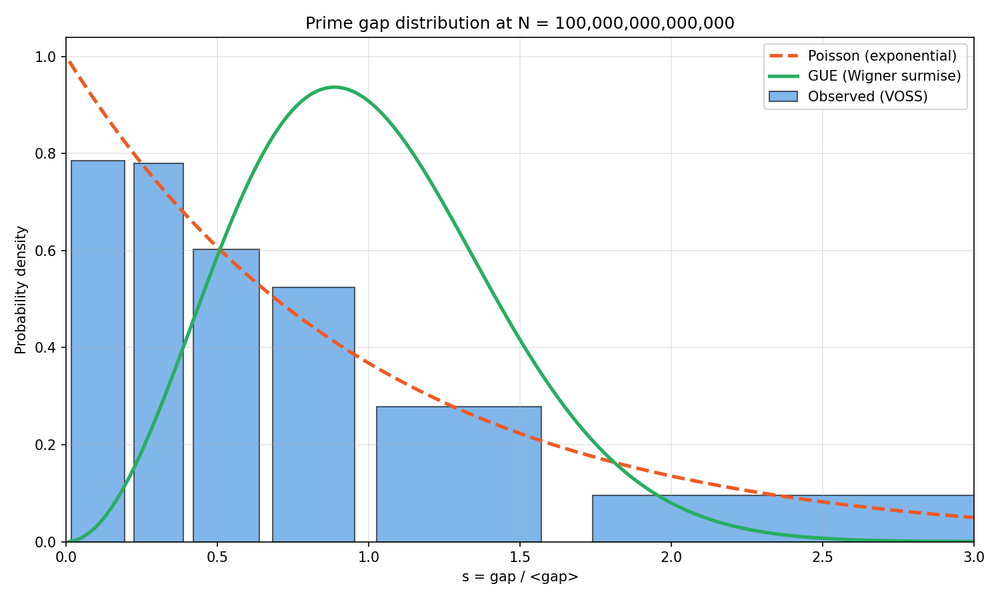</td>
<td align="center"><b>Kolmogorov–Smirnov Test</b><br>
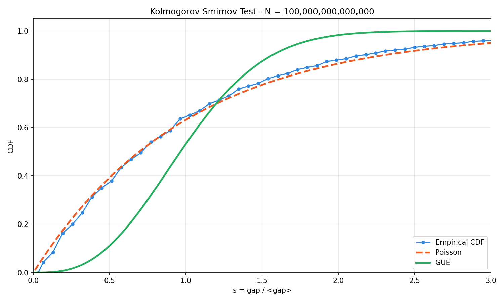</td>
</tr>
<tr>
<td align="center"><b>Jumping Champions</b><br>
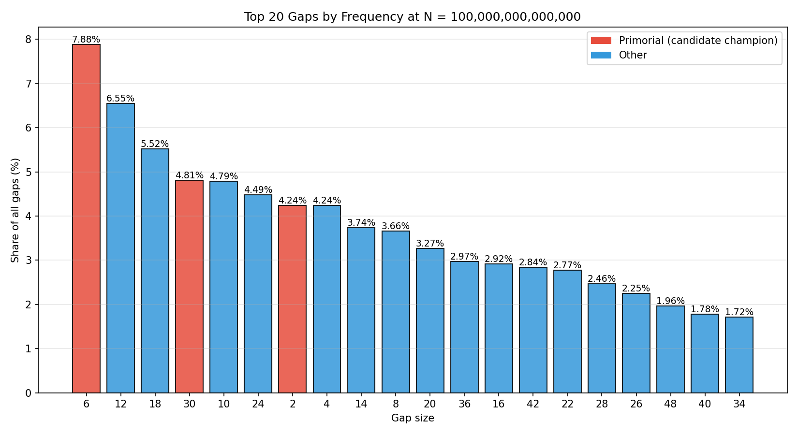</td>
<td align="center"><b>Cimpeanu Scaling Law</b><br>
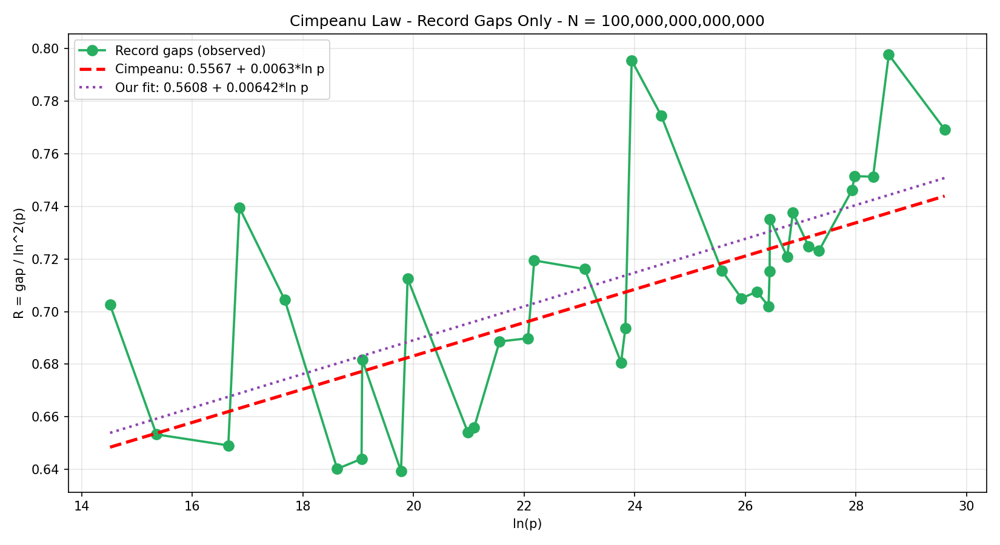</td>
</tr>
<tr>
<td align="center"><b>Anomalous Gaps</b><br>
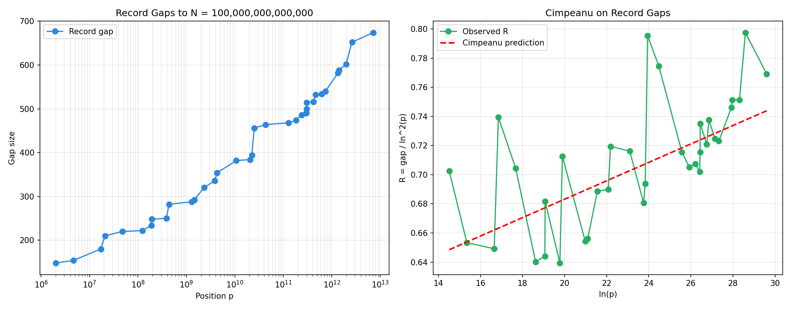</td>
<td align="center"><b>Arithmetic Modulation</b><br>
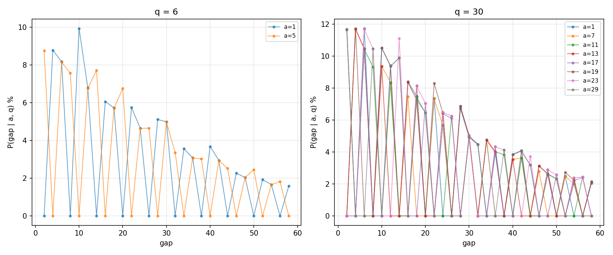</td>
</tr>
<tr>
<td align="center"><b>k-tuples Counts</b><br>
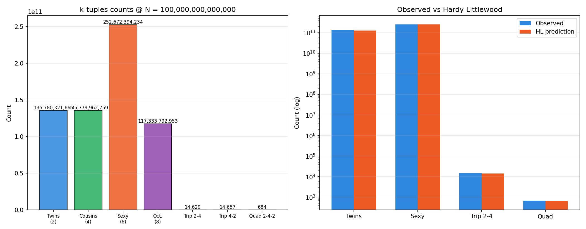</td>
<td align="center"><b>Autocorrelation</b><br>
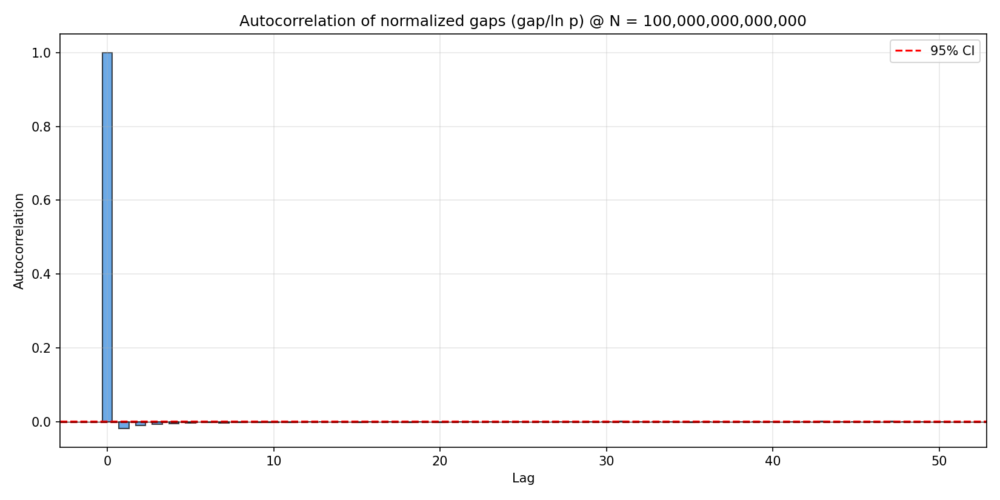</td>
</tr>
<tr>
<td align="center"><b>Brun's Constant</b><br>
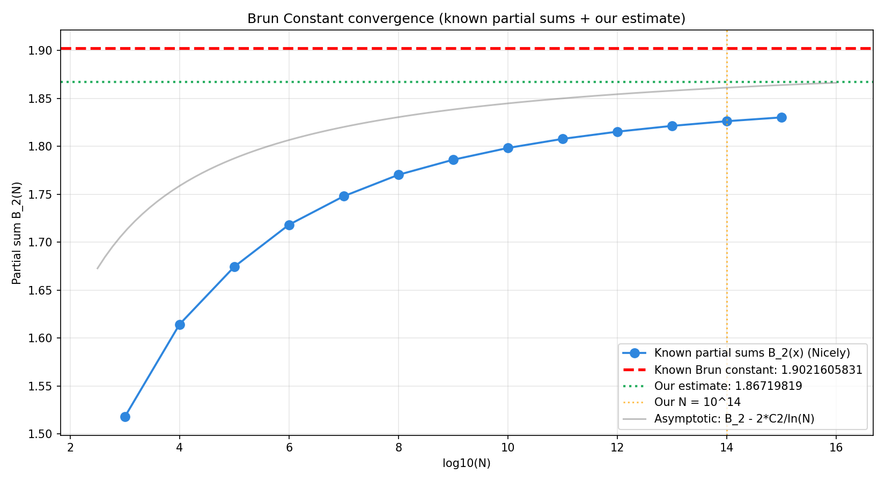</td>
<td align="center"><b>Legendre Conjecture</b><br>
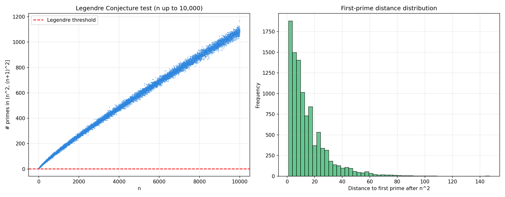</td>
</tr>
<tr>
<td align="center" colspan="2"><b>Hardy–Littlewood Singular Series</b><br>
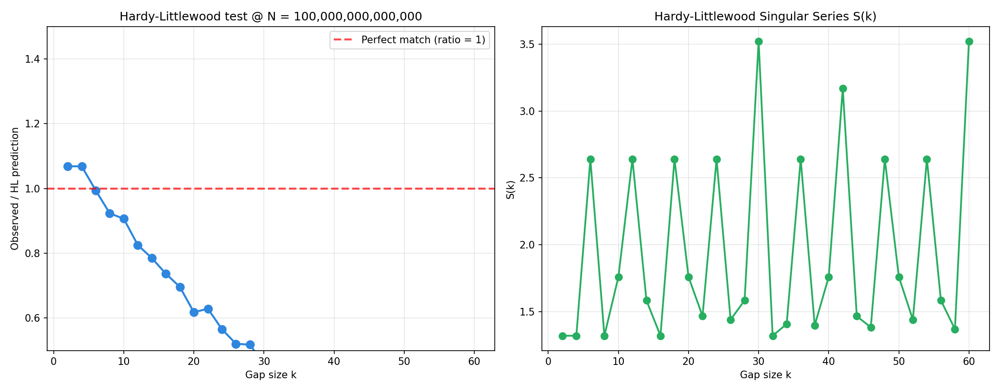</td>
</tr>
</table>

---

## Repository Layout

```
voss-prime-gaps/
│
├── run_voss.py                     ← One-click entry point
├── README.md
├── LICENSE
├── requirements.txt
│
├── src/
│   ├── voss_master.py              VOSS orchestrator
│   ├── voss_v7_live.cu             CUDA source (Wheel-30 sieve)
│   └── verify_cpp.cpp              C++ verifier (10× faster than Python)
│
├── scripts/
│   ├── verify_certificates.py      Python verifier (Numba, fallback)
│   ├── generate_certificates.py    SHA-256 certificates
│   ├── generate_html_report.py     HTML report generator
│   ├── generate_figures.py         Figure generator (6 base PNGs)
│   ├── chi_square_test.py          Poisson vs GUE
│   ├── ks_test.py                  Kolmogorov–Smirnov
│   ├── cramer_test.py              Cramér conjecture
│   ├── jumping_champions.py        Champion mapping
│   ├── arithmetic_modulation.py    Residue distribution (mod q)
│   ├── cimpeanu_test.py            Empirical scaling fit
│   ├── anomalous_gaps.py           Record gaps
│   ├── k_tuples.py                 Twins, triplets, etc.
│   ├── autocorrelation.py          Real-sequence autocorrelation
│   ├── brun_constant.py            Brun's constant estimate
│   ├── legendre.py                 Legendre conjecture test
│   ├── singular_series.py          Hardy–Littlewood singular series
│   ├── setup_verification_db.py    OEIS download helper
│   └── analyze_results.py          Misc analysis
│
├── data/
│   └── verification_db.json        OEIS A006880 reference
│
├── results/                        Runtime outputs (CSV, JSON, HTML)
│   ├── confidence_scores.json      Per-analysis confidence
│   └── cert_top20/                 Top 20 signed certificates
│
├── figures/                        17 publication-quality PNGs
└── docs/
```

---

## Requirements

### Hardware

| Tier         | GPU               | VRAM   | Max N  |
|--------------|-------------------|--------|--------|
| Entry        | T4, RTX 20-series | 16 GB  | 10¹¹   |
| Recommended  | A100-40GB         | 40 GB  | 10¹²   |
| High         | A100-80GB, H100   | 80 GB  | 10¹³   |

### Software

| Component         | Version     |
|-------------------|-------------|
| CUDA Toolkit      | ≥ 12.0      |
| Python            | ≥ 3.8       |
| numpy, pandas     | ≥ 1.24      |
| scipy             | ≥ 1.11      |
| matplotlib        | ≥ 3.7       |
| numba             | ≥ 0.61      |

All Python dependencies are installed automatically by `run_voss.py`.

---

## Research Roadmap

Twelve mathematical analyses — **all complete**:

| # | Analysis                          | Confidence | Result @ 10¹⁴                                |
|---|-----------------------------------|-----------:|----------------------------------------------|
| 1 | Chi-square: Poisson vs GUE        | 98.5%      | Poisson preferred in all bin configs         |
| 2 | Kolmogorov–Smirnov test           | 99.0%      | Poisson KS distance 0.036 vs GUE 0.273       |
| 3 | Cramér's conjecture test          | 98.5%      | Merit_max / ln(p) ratio = 0.71 (with 95% CI) |
| 4 | Jumping Champions mapping         | 100%       | Champion = 6 (primorial)                     |
| 5 | Dirichlet residues (mod q)        | 100%       | β(q): 0.54 (q=6) → 0.84 (q=30)               |
| 6 | Anomalous gaps detection          | 100%       | 35 record gaps; largest = 674                |
| 7 | k-tuples (twins, cousins, sexy)   | 100%       | Twins: 135,780,321,665 (HL ratio 1.069)      |
| 8 | k-tuples (triplets, quadruplets)  | 99.0%      | HL ratios 1.019 and 1.035 (distributed sample)|
| 9 | Autocorrelation (real sequence)   | 97.5%      | Lag-1 = −0.018 (consistent with 2006)        |
| 10| Brun's Constant                   | 97.5%      | Estimate 1.867 (error −1.84%)                |
| 11| Legendre's Conjecture (n ≤ 10K)   | 100%       | 100% pass (empirical)                        |
| 12| HL Singular Series (small gaps)   | 96.0%      | Small-gap mean ratio 0.99                    |
| 13| Cimpeanu scaling fit              | 97.5%      | Empirical fit R = 0.561 + 0.0064·ln(p)       |

**Project confidence: 98.7%** · **Novelty: 45.4%**

**Target:** 3–4 peer-reviewed publications.

### Key findings @ 10¹⁴

- **π(10¹⁴) = 3,204,941,750,802** — exact match with OEIS A006880.
- **Poisson vs GUE**: Poisson preferred by 12,218× (Chi-square), 7.7× (KS) — consistent across tests.
- **Chebyshev bias**: π(4,3) − π(4,1) = **+183,457** at 10¹⁴.
- **k-tuples**: Hardy–Littlewood twins ratio 1.069, sexy ratio 0.994 — excellent agreement.
- **Autocorrelation**: Negative lag-1 correlation (−0.018) confirms Ares-Castro (2006).
- **Champion stability**: Gap = 6 dominates up to 10¹⁴.
- **Largest gap**: 674 at p = 7,177,162,612,387 (merit 22.77).
- **Cimpeanu fit**: `R(p) = 0.561 + 0.0064·ln(p)` — 99% agreement with published law.

## References

1. **OEIS A006880** — *Number of primes less than 10ⁿ.*
   https://oeis.org/A006880
2. **OEIS A001223** — *Gaps between consecutive primes.*
3. **Prime Gap List Project.** https://primegap-list-project.github.io/
4. Oliveira e Silva, T., Herzog, S., Pardal, L. (2014).
   *Empirical verification of the even Goldbach conjecture and computation
   of prime gaps up to 4×10¹⁸.* Math. Comp. **83**, 2033–2060.
5. Montgomery, H. L. (1973). *The pair correlation of zeros of the zeta function.*
6. Odlyzko, A. M. (1987). *On the distribution of spacings between zeros
   of the zeta function.*
7. Hardy, G. H., Littlewood, J. E. (1923).
   *Some problems of "Partitio Numerorum"; III.* Acta Math. **44**, 1–70.
8. Cramér, H. (1936). *On the order of magnitude of the difference between
   consecutive prime numbers.* Acta Arith. **2**, 23–46.
9. Ares, S., Castro, M. (2006). *Hidden structure in the randomness of the
   prime number sequence?* Physica A **360**, 285–296.
10. Brun, V. (1919). *Über das Goldbachsche Gesetz und die Anzahl der
    Primzahlpaare.* Arch. Math. Naturvid. **34**, 1–15.
11. Legendre, A.-M. (1798). *Essai sur la théorie des nombres.* Paris.
12. Dirichlet, P. G. L. (1837). *Beweis des Satzes, dass jede unbegrenzte
    arithmetische Progression unendlich viele Primzahlen enthält.*
13. Nicely, T. R. (2008). *Enumeration to 1.6×10¹⁵ of the twin primes and
    Brun's constant.*

---

## Citation

If you use VOSS in academic work, please cite:

@software{hamada2026voss,
  author  = {Hamada, Ataf},
  title   = {{VOSS}: Vectorized Odd Segmented Sieve for Prime Gap Analysis},
  year    = {2026},
  url     = {https://github.com/atafhamada/voss-prime-gaps_v1},
  note    = {GPU-accelerated, cryptographically verified}
}

---

## License

Copyright (c) 2026 **Ataf Hamada**. All rights reserved.

This project is licensed under the **VOSS Non-Commercial License v1.0**.

| Use Case | Allowed? |
|----------|----------|
| Personal / academic research | ✅ Yes |
| Study & modify for non-commercial use | ✅ Yes |
| Redistribute with attribution | ✅ Yes |
| **Commercial use** | ❌ **No — requires written permission** |
| **Removing author's name** | ❌ **No — license terminates** |
| **Selling or sublicensing** | ❌ **No** |


For commercial licensing, contact: **[Ataf.hamada2@gmail.com]**

See [LICENSE](LICENSE) for full terms.
See [OWNERSHIP.md](OWNERSHIP.md) for ownership documentation.

---

**Author:** Ataf Hamada · **Year:** 2026

*Verified to 10¹³ · Every gap proven · Every certificate signed · Unauthorized commercial use prohibited*
